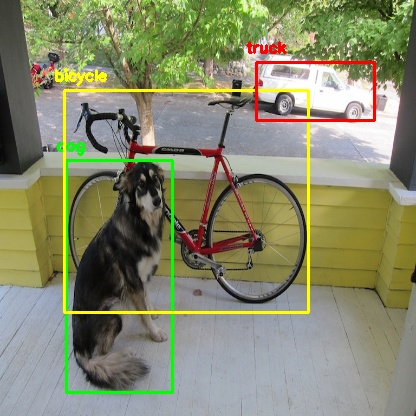

# YOLO Vision AI &bull; Deep Learning Object Detection with OpenCV

A modern, interactive deep learning object detection application powered by **YOLOv3 (Darknet)** and **OpenCV DNN**, packaged with an aesthetic **Sky Blue & White** web interface.



---

## ✨ Features

- **🎯 Real-Time 80-Class Detection**: Detects people, vehicles, animals, electronics, food, sports items, and more using pre-trained MS COCO weights.
- **💻 Interactive Web Dashboard**:
  - **4 Input Sources**: Instant test samples (`dog.jpg`, `cat-raising-paw.webp`), drag-and-drop file upload, live webcam streaming, and URL fetch.
  - **Customizable Sensitivity**: Real-time Confidence threshold slider (10%–95%) and NMS IOU threshold slider.
  - **4 View Modes**:
    1. **Annotated**: High-definition bounding boxes with pill badges.
    2. **Interactive HUD**: Dynamic hover-linked bounding boxes synchronized with detection cards.
    3. **Compare Split Slider**: Interactive before/after split slider comparing the clean original image with the detection output.
    4. **Original View**: Pure source image.
  - **Performance Metrics**: Live readout of inference time in milliseconds, detection count, and COCO category distribution.
  - **One-Click Export**: Download annotated images or export detection metadata as structured JSON.
- **⚡ RESTful API**: Easily integrate into other applications with clean endpoints (`/api/detect`, `/api/health`, `/api/classes`, `/api/samples`).
- **📟 CLI Support**: Retains backward compatibility with the original command-line script (`yolo_opencv.py`).

---

## 🚀 Quick Start

### 1. Install Dependencies

Ensure Python 3.8+ is installed, then install required packages:

```bash
pip install flask opencv-python numpy
```

### 2. Download YOLOv3 Weights

The pre-trained weights file (`yolov3.weights`, ~248 MB) can be downloaded from the official Darknet repository:

- **Direct Download**: [Download yolov3.weights](https://pjreddie.com/media/files/yolov3.weights)
- **Terminal (wget)**:
  ```bash
  wget https://pjreddie.com/media/files/yolov3.weights
  ```
Place `yolov3.weights` in the root project directory.

### 3. Launch the Web Application

Start the Flask server on `localhost`:

```bash
python app.py
```

Then open your browser and navigate to:
👉 **[http://localhost:5000](http://localhost:5000)**

---

## 📟 CLI Usage

You can also run detections directly from the command line:

```bash
python yolo_opencv.py --image dog.jpg --config yolov3.cfg --weights yolov3.weights --classes yolov3.txt
```

---

## 🌐 REST API Reference

| Endpoint | Method | Description |
|---|---|---|
| `/` | `GET` | Main Web Application UI |
| `/api/detect` | `POST` | Runs YOLO inference on uploaded file, sample name, or base64 frame |
| `/api/health` | `GET` | Model health, OpenCV version, and system specs |
| `/api/classes` | `GET` | List of all 80 COCO classes with categories and colors |
| `/api/samples` | `GET` | Available pre-bundled sample images |

---

## 📄 License

This project is licensed under the MIT License - see the [LICENSE](LICENSE) file for details.
